# Guide d'installation — DevBrain

Ce guide t'accompagne pas à pas pour installer DevBrain et le connecter à Claude Code (ou n'importe quel agent compatible MCP).

> **Durée estimée :** 15-20 minutes.
> **Captures :** Obsidian 1.12.7 en français sur Windows 11. Les libellés en anglais sont entre parenthèses quand c'est utile.

---

## Sommaire

1. [Aperçu — à quoi ça ressemble une fois installé](#1-aperçu--à-quoi-ça-ressemble-une-fois-installé)
2. [Pré-requis](#2-pré-requis)
3. [Cloner le dépôt](#3-cloner-le-dépôt)
4. [Ouvrir DevBrain comme coffre Obsidian](#4-ouvrir-devbrain-comme-coffre-obsidian)
5. [Activer les modules complémentaires](#5-activer-les-modules-complémentaires)
6. [Installer les 4 plugins requis](#6-installer-les-4-plugins-requis)
   - 6.1. [Local REST API & MCP Server](#61-local-rest-api--mcp-server)
   - 6.2. [Templater](#62-templater)
   - 6.3. [Dataview](#63-dataview)
   - 6.4. [File Hider](#64-file-hider)
7. [Récupérer la clé API et l'endpoint MCP](#7-récupérer-la-clé-api-et-lendpoint-mcp)
8. [Configurer Templater pour pointer sur `Templates/`](#8-configurer-templater-pour-pointer-sur-templates)
9. [Cacher `AI/` avec File Hider](#9-cacher-ai-avec-file-hider)
10. [Connecter Claude Code via MCP](#10-connecter-claude-code-via-mcp)
11. [Installer les Skills Obsidian (kepano)](#11-installer-les-skills-obsidian-kepano)
12. [Personnaliser les fichiers `CLAUDE.md`](#12-personnaliser-les-fichiers-claudemd)
13. [(Optionnel) Hook Stop pour la mémoire de session](#13-optionnel-hook-stop-pour-la-mémoire-de-session)
14. [Vérifier que tout marche](#14-vérifier-que-tout-marche)
15. [Dépannage](#15-dépannage)

---

## 1. Aperçu — à quoi ça ressemble une fois installé

Une fois DevBrain installé, ton coffre Obsidian aura cette structure :


À gauche : l'arborescence du vault. À droite : un *Comparatif* `.base` qui se remplit tout seul en lisant le frontmatter de toutes les fiches Services correspondantes (ici, les frameworks LLM open-source).

Chaque fiche Service utilise un frontmatter dense, lisible par Claude comme par toi en mode lecture :

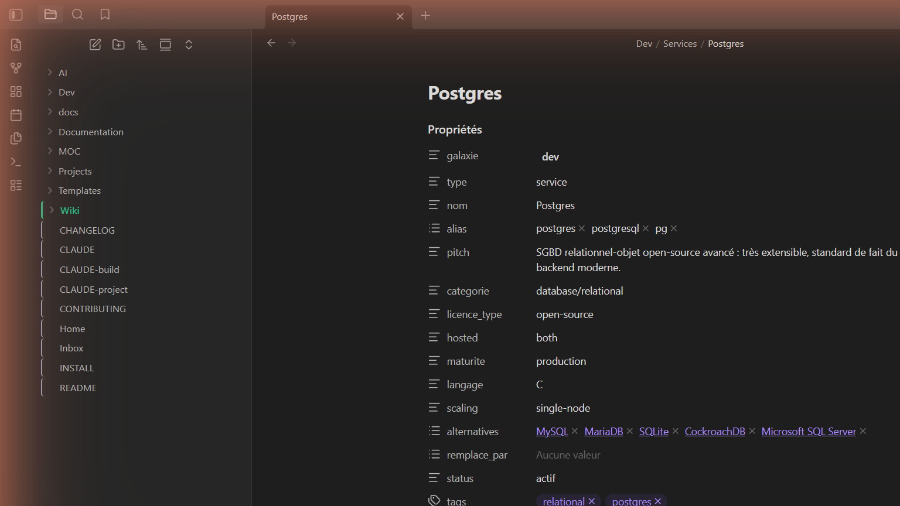

C'est la combinaison **frontmatter + Bases** qui permet à Claude (et à toi) de poser des questions comme "liste mes vector DBs open-source score≥4" sans rien indexer.

---

## 2. Pré-requis

Installe d'abord :

| Outil | Version mini | Vérification |
|-------|--------------|--------------|
| [Obsidian](https://obsidian.md/download) | 1.10+ | Ouvrir l'app |
| [Git](https://git-scm.com/downloads) | — | `git --version` |
| [Node.js](https://nodejs.org/) | 18+ | `node --version` |
| [Python](https://www.python.org/downloads/) | 3.10+ | `python --version` |
| [`uv`](https://docs.astral.sh/uv/getting-started/installation/) | — | `uvx --version` |
| [Claude Code](https://docs.claude.com/en/docs/claude-code) | — | `claude --version` |

> `uv` n'est pas Python. C'est un installateur de paquets Python ultra-rapide, on s'en sert pour lancer le serveur MCP `mcp-obsidian` sans polluer ton environnement Python.

---

## 3. Cloner le dépôt

```bash
git clone https://github.com/floSa/DevBrain.git ~/DevBrain
cd ~/DevBrain
```

Sur Windows tu peux remplacer `~/DevBrain` par `%USERPROFILE%\Documents\Projets\DevBrain` ou n'importe quel emplacement persistant (évite `Desktop` ou `Downloads`).

---

## 4. Ouvrir DevBrain comme coffre Obsidian

Lance Obsidian. Au premier démarrage (ou via *File → Open Vault*), le sélecteur de coffre s'affiche :

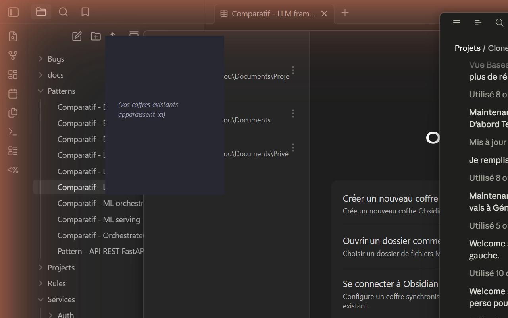

Clique sur **Ouvrir** *(Open)* à droite de "Ouvrir un dossier comme coffre" *(Open folder as vault)*. Une boîte Windows s'ouvre — navigue jusqu'au dossier `DevBrain` que tu viens de cloner :

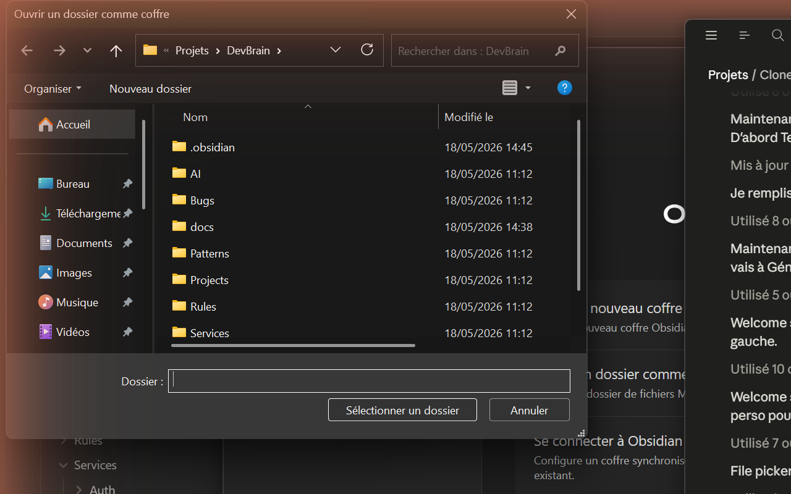

Tu peux soit naviguer manuellement, soit coller le chemin dans le champ **Dossier :** puis cliquer **Sélectionner un dossier**.

Une fois ouvert, l'arborescence du vault apparaît dans la barre latérale gauche :

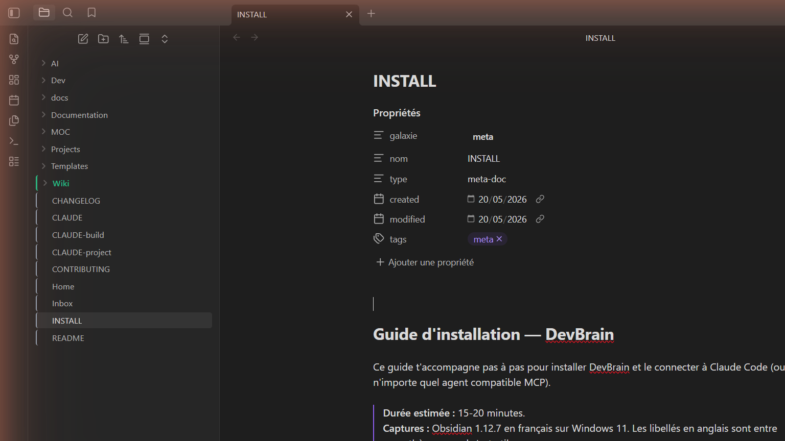

Tu dois voir les dossiers `AI`, `Dev`, `docs`, `Documentation`, `MOC`, `Projects`, `Templates`, `Wiki` et les fichiers `CHANGELOG.md`, `CLAUDE.md`, `CLAUDE-build.md`, `CLAUDE-project.md`, `CONTRIBUTING.md`, `Home.md`, `Inbox.md`, `README.md`.

> 💡 **À la première ouverture du vault, Obsidian peut afficher un message "Faire confiance à l'auteur" puisque DevBrain contient des fichiers `.base`. Accepte.**

---

## 5. Activer les modules complémentaires

Par défaut, Obsidian protège ton coffre avec le **mode restreint** : aucun plugin tiers ne peut tourner. On va le désactiver pour ce vault uniquement (les autres coffres ne sont pas affectés).

Ouvre les paramètres avec `Ctrl + ,` *(Cmd+, sur Mac)*. La vue **Général** s'affiche :

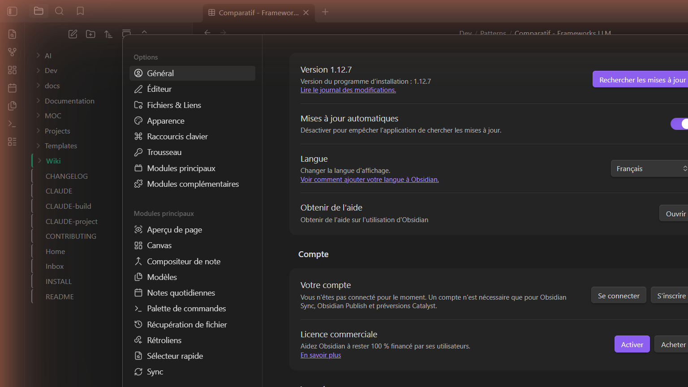

Clique sur **Modules complémentaires** *(Community plugins)* dans la barre de gauche. Le mode restreint est actif :

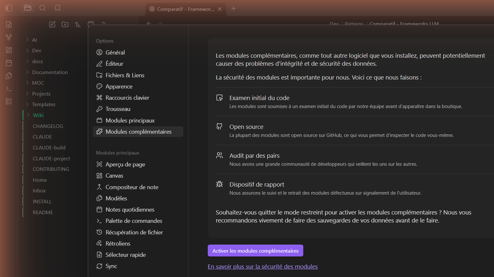

Clique sur **Activer les modules complémentaires** *(Turn on community plugins)*.

Le panneau se met à jour : `Mode restreint` passe à *désactivé* et le bouton **Parcourir** *(Browse)* devient cliquable :

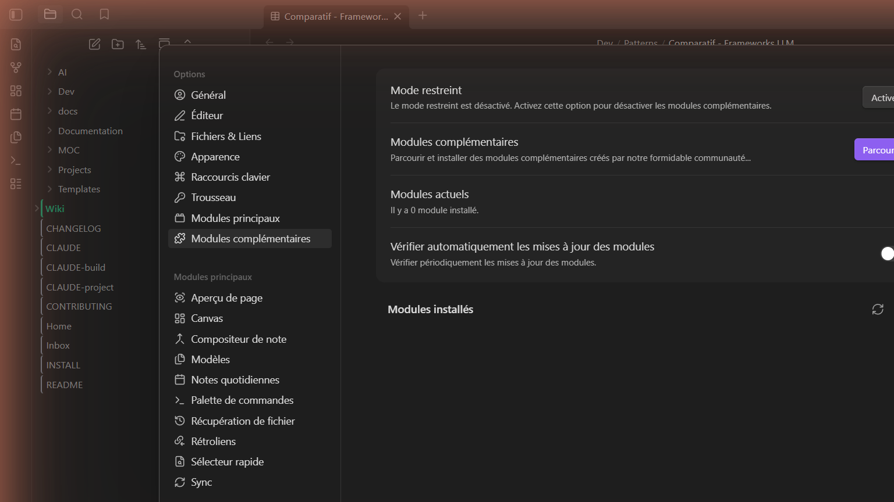

---

## 6. Installer les 4 plugins requis

Clique sur **Parcourir** *(Browse)*. Le catalogue communautaire s'ouvre :

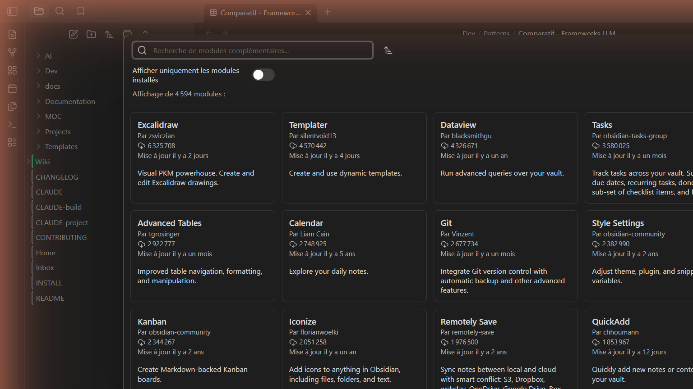

Tu vas installer ces 4 plugins. Pour chacun : tape son nom dans la barre de recherche, clique sur la carte du résultat, puis **Installer** *(Install)* puis **Activer** *(Enable)*. Le détail de chaque plugin est expliqué juste après le tableau.

| # | Plugin | Auteur (id repo) | Rôle dans DevBrain |
|---|--------|------------------|---------------------|
| 1 | **Local REST API & MCP Server** | Adam Coddington (`coddingtonbear`) | Expose le vault via HTTPS sécurisé. Sans lui, **Claude Code ne peut rien lire ni écrire** dans ton brain. |
| 2 | **Templater** | SilentVoid13 | Remplit automatiquement les nouvelles fiches (Service, REX, Projet) avec le bon frontmatter, la date du jour, l'arborescence cible. |
| 3 | **Dataview** | blacksmithgu | Permet d'écrire des requêtes type SQL sur le frontmatter (`LIST FROM "Dev/Services" WHERE score=5`). Sert de fallback si tu n'utilises pas encore les `.base`. |
| 4 | **File Hider** | Oliver Akins (`eldritch-oliver`) | Cache `AI/` (mémoire et hooks de l'agent) et autres dossiers techniques de la sidebar, pour que ta vue reste propre. |

### 6.1. Local REST API & MCP Server — le pont avec Claude

**À quoi ça sert :** ce plugin transforme ton Obsidian en *serveur local* qui répond en HTTPS sur `127.0.0.1:27124`. Quand Claude Code (ou Claude Desktop, Codex, n'importe quel agent compatible MCP) veut lire une fiche ou en écrire une, il interroge ce serveur. C'est **la fondation** de tout DevBrain : sans lui, l'IA voit le repo Git mais pas le vault vivant (frontmatter, Bases, etc.).

Le plugin expose deux interfaces sur le même port :
- une **REST API** classique (`GET /vault/...`, `POST /vault/...`) pour les scripts custom
- un **endpoint MCP** (`/mcp`) que les agents IA parlent nativement depuis Claude 3.5+

Tape `Local REST API` dans la recherche. Le bon résultat est **Local REST API with MCP** par Adam Coddington (`coddingtonbear`, ~490k téléchargements). Attention : il y a d'autres résultats (« MCP REST » par swarogan, « Local REST API Second Brain MCP Extension ») — **pas** ceux qu'on veut.

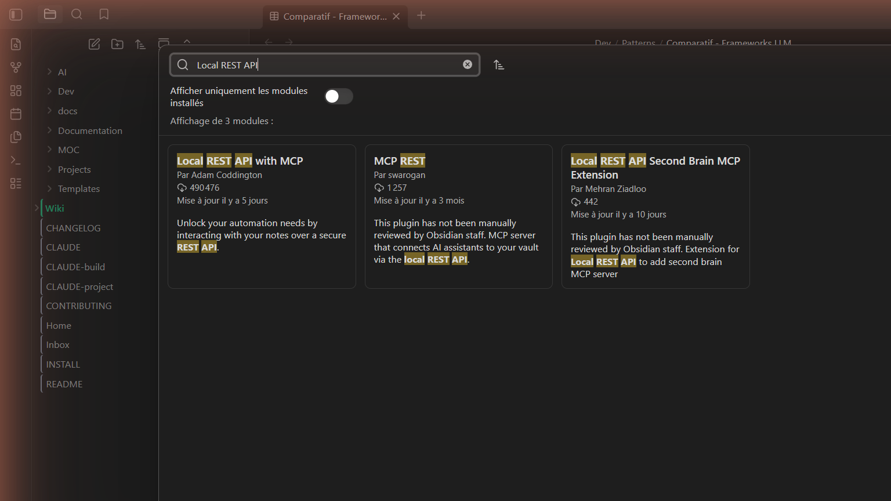

Clique sur la carte, puis **Installer** :

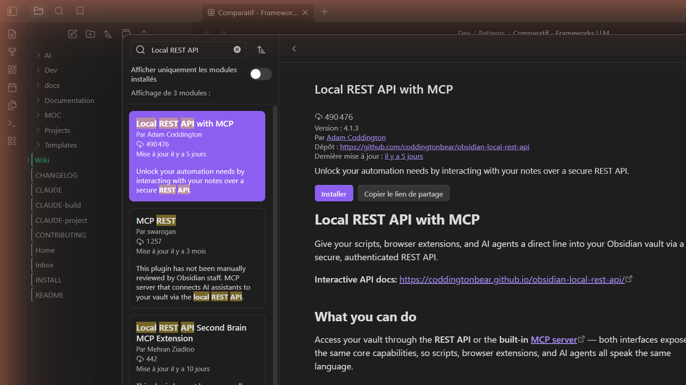

Une fois installé, le bouton devient **Activer**. Clique dessus :

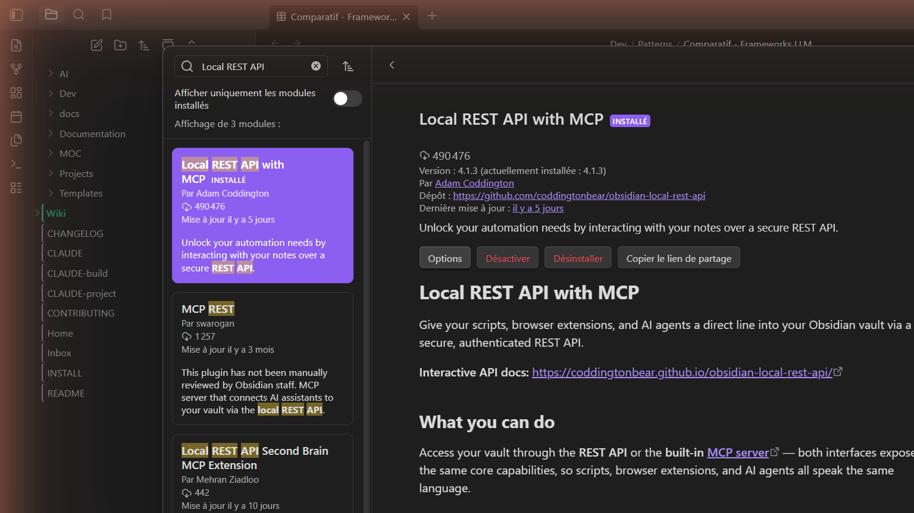

Dès qu'il est activé, le serveur tourne. Tu peux le vérifier dans n'importe quel navigateur en allant sur `https://127.0.0.1:27124/` (le navigateur va râler sur le certificat auto-signé — c'est normal).

> 🔐 **Note sécurité :** le serveur n'écoute que sur `127.0.0.1` (loopback), donc inaccessible depuis ton réseau local ou Internet. Il faut aussi la clé API pour faire quoi que ce soit. Tu ne peux pas te faire pirater par défaut.

### 6.2. Templater — les fiches qui s'auto-remplissent

**À quoi ça sert :** Templater est un moteur de templates dynamiques. Quand tu crées une nouvelle fiche Service avec le skill `enrichir-brain`, ce n'est pas un fichier markdown vide qui apparaît — c'est une fiche pré-remplie avec :

- le **frontmatter standardisé** (`nom`, `categorie`, `pitch`, `licence_type`, etc. — ~14 champs, cf. `Templates/Service-Dev.md`)
- les **sections markdown obligatoires** (`## Pourquoi`, `## Quand l'utiliser`, `## Pièges`, `## Liens`)
- des **wikilinks pré-remplis** vers `REX - <nom>` etc.

Sans Templater, tu devrais recopier ces lignes à la main à chaque nouvelle fiche. Les autres gabarits (`Concept-Wiki.md`, `Pattern.md`, `Rule.md`, `REX.md`) fonctionnent pareil.

Reviens à la liste *(flèche ← en haut à gauche, ou clique sur la barre de recherche puis efface)*, retape `Templater`. Le bon résultat est de **SilentVoid13** (~4M téléchargements). Clique sur sa carte → **Installer** → **Activer**.

> ℹ️ On configurera son dossier de templates à l'étape 8 (sinon il ne saura pas où chercher).

### 6.3. Dataview — requêtes sur le brain

**À quoi ça sert :** Dataview lit le frontmatter de toutes les notes et te laisse les interroger avec un mini-langage type SQL. Exemple concret :

````markdown
```dataview
LIST FROM "Dev/Services"
WHERE categorie = "database/relational" AND licence_type = "open-source" AND score >= 4
SORT score DESC
```
````

…te renvoie la liste de toutes les bases relationnelles open-source que tu as notées 4 ou plus.

Depuis Obsidian 1.10, le format `.base` natif fait pareil (et c'est ce que DevBrain utilise par défaut dans `Dev/Patterns/Comparatif - *.base`). Mais Dataview reste utile pour :
- les **requêtes ad-hoc inline** dans une fiche (le format `.base` est un fichier séparé)
- la **rétrocompatibilité** si tu ouvres le vault avec une version d'Obsidian < 1.10
- les **scripts Claude** qui génèrent du markdown dynamique : Dataview est plus simple à écrire pour l'IA que `.base`

Pareil. Retape `Dataview`. Choisis le plugin de **blacksmithgu** (~4M téléchargements). **Installer** + **Activer**.

### 6.4. File Hider — sidebar propre

**À quoi ça sert :** DevBrain a un dossier `AI/` qui contient des trucs techniques que tu ne dois pas voir 24h/24 :
- `AI/sessions/` — résumés auto des conversations passées avec Claude
- `AI/prompts/` — prompts réutilisables
- `AI/scripts/` — scripts d'index et d'hygiène
- `AI/index/` — index généré (`brain-index.json`), ne s'édite jamais à la main

Tout ça pollue ta sidebar et te distrait quand tu cherches une vraie fiche. File Hider permet de **cacher** ces dossiers de l'explorateur Obsidian — les fichiers sont toujours là, Claude peut toujours les lire, mais toi tu ne les vois plus.

Le plugin ajoute simplement une option **"Hide Folder"** / **"Hide File"** au clic droit dans la sidebar. On l'utilisera à l'étape 9 pour cacher `AI/`.

⚠️ **Attention au choix exact** : la recherche `File Hider` renvoie 2 résultats. Tu veux **File Hider** par **eldritch-oliver** (Oliver Akins, ~43k téléchargements), **pas** *Explorer Hider* (mara-li). Les deux font le même genre de chose mais on a calibré DevBrain pour File Hider.

Retape `File Hider`. Choisis le plugin d'eldritch-oliver. **Installer** + **Activer**.

### État final attendu

Ferme la page Parcourir et reviens à **Modules complémentaires**. Tu dois voir tes 4 plugins listés et tous les toggles violets (activés) :

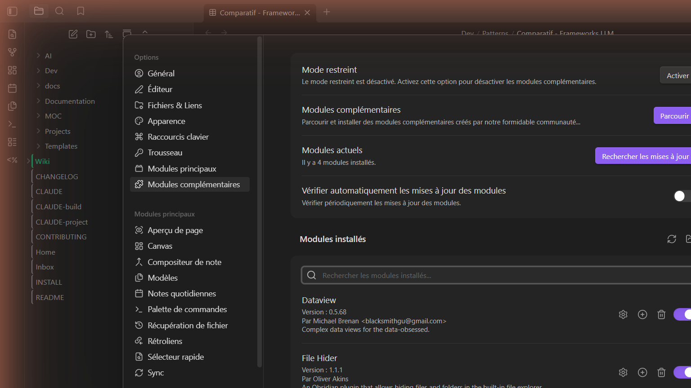

---

## 7. Récupérer la clé API et l'endpoint MCP

C'est l'étape qui permettra à Claude Code de lire/écrire dans ton vault.

Dans **Modules complémentaires** → ligne **Local REST API & MCP Server** → clique sur l'icône engrenage à droite.

Le panneau d'options s'ouvre. Note :

- **URL HTTPS** : `https://127.0.0.1:27124/` (port par défaut **27124**)
- **API key** : chaîne `Bearer ...` (~64 caractères). C'est ta clé secrète — traite-la comme un mot de passe.

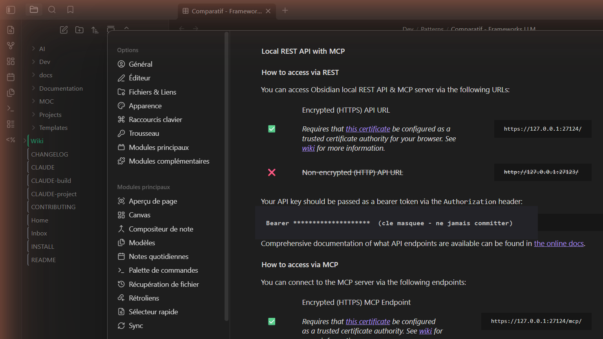

> ⚠️ **Sécurité :** ne commit jamais cette clé. Elle donne un accès complet en lecture/écriture à tout ton vault. Si tu la fuites, regénère-la (voir plus bas, *Re-generate certificates* ou *Reset all crypto*).

Scrolle plus bas. La section **How to access via MCP** te donne directement le bloc JSON à coller dans la config Claude Code :

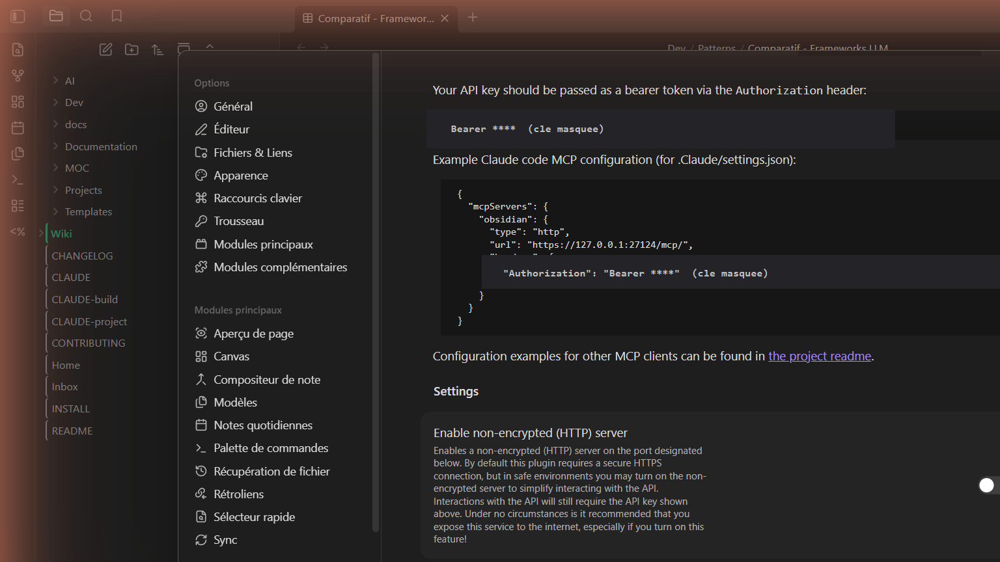

L'endpoint MCP est `https://127.0.0.1:27124/mcp` — c'est ce que tu utiliseras à l'étape 10.

Plus bas encore, des options avancées (regénérer le certificat, reset crypto, activer le HTTP non chiffré) :

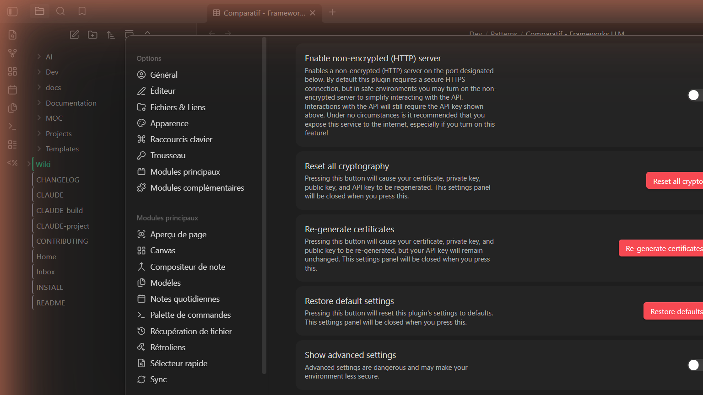

> 🔒 Laisse **Enable non-encrypted (HTTP) server** désactivé. Le HTTPS auto-signé suffit en local et ne dégrade pas la sécu.

Copie ta clé API (le bouton **Copier** à droite). On l'utilisera à l'étape 10.

---

## 8. Configurer Templater pour pointer sur `Templates/`

Sans cette étape, Templater ne saura pas où chercher les templates de DevBrain.

Toujours dans Settings → barre latérale → bas → clique sur **Templater** (sous "Modules complémentaires") :

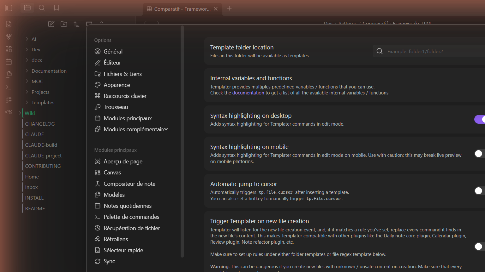

Dans le champ **Template folder location**, tape `Templates`. Obsidian autocomplète. Sélectionne `Templates` (pas `Templates/ServiceDocs`) :

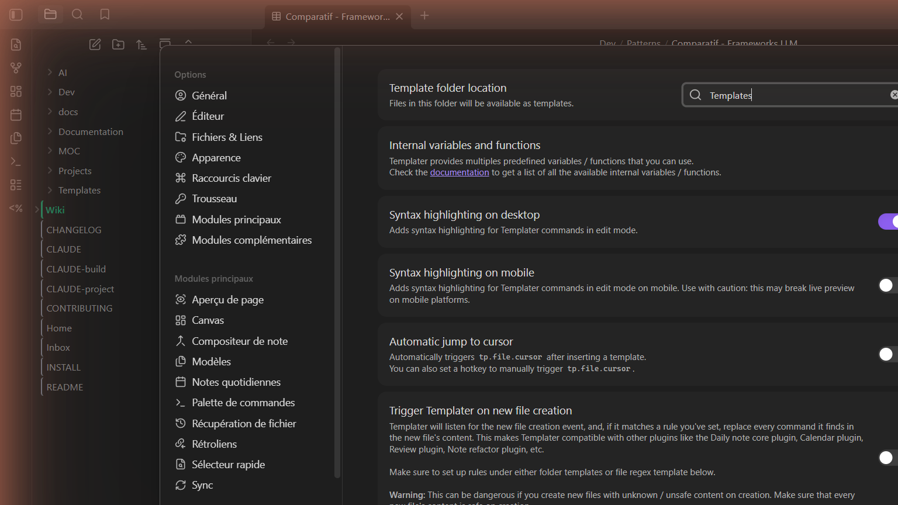

C'est tout pour Templater. Les autres options (syntax highlighting, jump to cursor) sont en valeurs par défaut OK.

---

## 9. Cacher `AI/` avec File Hider

`AI/` contient ta mémoire de session, tes prompts, tes hooks. C'est l'espace de l'agent — pas le tien. On le masque pour ne pas polluer la sidebar.

File Hider ne se configure pas dans les Options du plugin — il fonctionne par clic droit dans l'explorateur.

Ferme Settings (`Échap`). Dans la sidebar du vault, **clic droit sur le dossier `AI`** :

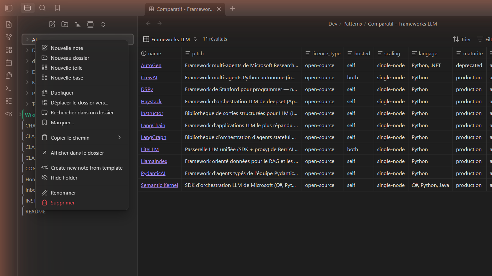

Clique sur **Hide Folder**. Le dossier disparaît de la sidebar :

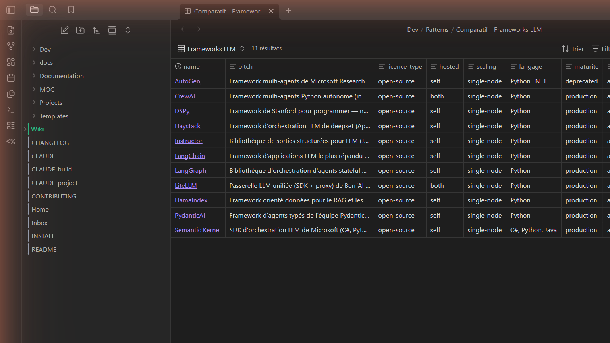

Refais la même chose pour `.obsidian/` si tu veux (mais Obsidian le masque déjà par défaut dans la sidebar — pas indispensable).

> ↩️ **Annuler :** Settings → File Hider → toggle **Hidden File Visibility** sur ON pour réafficher tous les fichiers cachés temporairement.

---

## 10. Connecter Claude Code via MCP

Maintenant on branche Claude Code sur le MCP server qui tourne dans Obsidian.

**Méthode 1 — Via `claude mcp add`** (recommandée) :

```bash
claude mcp add devbrain \
  --command uvx \
  --args mcp-obsidian \
  --env OBSIDIAN_API_KEY=<colle_ta_cle_ici> \
  --env OBSIDIAN_HOST=127.0.0.1 \
  --env OBSIDIAN_PORT=27124
```

> Sur Windows PowerShell, remplace les `\` de fin de ligne par des backticks `` ` ``, ou mets tout sur une ligne.

**Méthode 2 — Via `.claude/settings.json` direct** (utilise le JSON déjà fourni par le plugin) :

Récupère le bloc JSON exact depuis le panneau Local REST API (capture en 7). Copie-le dans `.claude/settings.json` à la racine de ton vault DevBrain (ou dans le projet où tu veux que Claude ait accès au brain).

Vérifie ensuite :

```bash
claude mcp list
```

Tu dois voir une ligne `devbrain` avec status `✓ Connected`. Si c'est ✗, va à la section [Dépannage](#15-dépannage).

---

## 11. Installer les Skills Obsidian (kepano)

**À quoi ça sert :** Claude ne connaît pas la syntaxe Obsidian par défaut. Si tu lui demandes de créer une fiche, il va écrire du markdown générique : pas de wikilinks (`Postgres`), pas de Bases, des callouts mal formés, des Canvas inconnus. Les skills officiels [`kepano/obsidian-skills`](https://github.com/kepano/obsidian-skills) de Steph Ango (CEO d'Obsidian) lui apprennent ces conventions.

Concrètement, après cette étape, Claude saura :
- linker entre fiches avec `Nom` (et utiliser les alias frontmatter)
- écrire un bloc `.base` valide avec filtres et colonnes
- formater des callouts (`> [!info]`, `> [!warning]`, `> [!example]`)
- générer du Canvas si tu lui demandes un schéma
- comprendre les properties typées (multi-select, date, lien)

Le second skill, `kepano/defuddle`, est un parseur HTML→markdown propre — utile quand tu colles un article web et veux que Claude le nettoie au format Obsidian.

```bash
npx skills add kepano/obsidian-skills
npx skills add kepano/defuddle
```

> ℹ️ La commande `npx skills` est l'installeur officiel des skills Claude. Elle clone le repo skill dans `~/.claude/skills/<nom>/` et l'enregistre. Vérifie après : `npx skills list` doit montrer les deux.

Les **skills custom DevBrain** (`enrichir-brain`, `planifier-projet`) sont déjà dans `.claude/skills/` du repo — pas besoin de les installer séparément, Claude Code les charge automatiquement quand il est lancé depuis le dossier du vault.

---

## 11.5. Activer le code couleurs galaxies (optionnel mais recommandé)

Le brain est structuré en 3 **galaxies** portées par le champ `galaxie:` du frontmatter, plus un regroupement visuel par chemin pour les skills (qui n'ont pas ce champ) :

- 🔵 **DEV** (`#3B82F6` bleu acier) — outils & pratiques : `Dev/` (Services, Patterns, Outils, Rules, REX)
- 🟢 **WIKI** (`#10B981` vert sauge) — pensée & savoir : `Wiki/Concepts/` (peuplé), `Wiki/Outils/`, `Wiki/Workflows/`, `Wiki/Roadmaps/` (vides, pas encore remigrés)
- ⚪ **META** (`#94A3B8` slate-gray) — docs du brain lui-même : `CHANGELOG.md`, `README.md`, `INSTALL.md`, `Home.md`, `Inbox.md`, `CLAUDE*.md`, `CONTRIBUTING.md`, + `Documentation/`, `AI/design/`, `AI/scripts/`
- 🟣 **SKILLS** (`#8B5CF6` violet, regroupement par chemin) — `.claude/skills/` : les `SKILL.md` portent le frontmatter Anthropic strict, sans champ `galaxie:`

Deux choses à activer côté Obsidian : le **snippet CSS** (couleurs dans la sidebar, les onglets, les notes) et le **graph view avec groupes** (couleurs dans le graphe).

### A. Activer le snippet CSS

Le fichier `.obsidian/snippets/galaxies.css` est versionné dans le repo. Pour l'activer :

1. **Settings** → **Apparence** *(Appearance)*
2. Scrolle tout en bas jusqu'à la section **Extraits CSS** *(CSS snippets)*
3. Cherche **galaxies** dans la liste
4. Clique sur le toggle à droite — il devient violet/actif

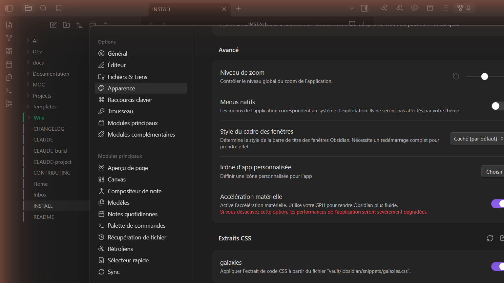

Le toggle **galaxies** passe au violet et l'effet est immédiat dans la sidebar (ici `Wiki` en vert, fichiers avec leur barre de galaxie colorée).

Effets visuels immédiats (recharge le vault si besoin, `Ctrl+R`) :
- **Sidebar** : dossiers et fichiers ont une barre verticale colorée + titres de dossiers en gras coloré
- **Onglets** : un fin trait coloré au-dessus de l'onglet selon la galaxie de la note ouverte
- **Note ouverte** : bord gauche coloré selon le champ `galaxie:` du frontmatter
- **Property** `galaxie:` dans le panneau Properties : rendue en pastille colorée

### B. Activer le module Graph et configurer les groupes

> ⚠️ Si tu ne vois pas **Affichage du graphique** dans tes Settings, c'est que le module natif Obsidian est désactivé. Active-le d'abord :
>
> 1. **Settings** → **Modules principaux** *(Core plugins)*
> 2. Cherche **Affichage du graphique** *(Graph view)* dans la liste
> 3. Clique sur le toggle (à droite) pour l'activer
>
> Une icône en forme de petit graphe nodal apparaît alors dans la **barre latérale gauche**.

Une fois le module activé, configurer les groupes :

1. Clique sur l'icône **Affichage du graphique** dans la sidebar gauche pour ouvrir le graphe
2. Dans le panneau du graphe, clique sur l'icône **engrenage** (en haut à droite, dans le panneau du graphe lui-même)
3. Va dans l'onglet **Groupes** *(Groups)*
4. Clique 7 fois sur **Nouveau groupe** *(New group)* et configure chacun **dans cet ordre** :

| # | Requête (à coller telle quelle) | Couleur (hex — RGB) |
|---|---|---|
| 1 | `path:MOC/Themes/` | 🟡 or `#FFD43B` — 255/212/59 |
| 2 | `path:MOC/Categories/` | 🟠 orange `#FF922B` — 255/146/43 |
| 3 | `path:MOC/Concepts/` | 🟠 orange `#FF922B` — 255/146/43 |
| 4 | `path:.claude/skills/` | 🔴 `#E05252` — 224/82/82 |
| 5 | `["galaxie":"dev"]` | 🔵 bleu `#412DDD` — 65/44/221 |
| 6 | `["galaxie":"wiki"]` | 🟢 vert `#7AB800` — 122/184/0 |
| 7 | `["galaxie":"meta"]` | 🟠 ambre `#F5B400` — 245/180/0 |

Pour la couleur : à droite de la requête, clique sur le petit carré de couleur → un sélecteur s'ouvre. Dans Obsidian 1.12.7, le plus simple est de saisir les trois champs **R / G / B** en bas du sélecteur (valeurs ci-dessus), puis `Entrée`.

> ⚠️ **L'ordre des règles compte.** Les pages `MOC/` ont techniquement `galaxie: wiki` dans leur frontmatter ; pour les colorer en or/orange, leurs règles `path:MOC/...` doivent être **avant** la règle `["galaxie":"wiki"]` (Obsidian applique la première règle qui matche).

> 💡 **Pourquoi `["galaxie":"X"]` pour DEV/WIKI mais `path:` pour MOC et SKILLS ?** La syntaxe `["champ":"valeur"]` cible le frontmatter (`galaxie: dev | wiki | meta`, présent sur toutes les fiches). Les hubs `MOC/` (3 niveaux : Themes → Concepts/Categories → feuilles) et les `SKILL.md` de `.claude/skills/` se ciblent par **chemin** : les MOC pour primer sur leur galaxie, les skills car leur frontmatter Anthropic strict n'a pas le champ `galaxie:`.

Une fois les 7 groupes saisis, le panneau **Groupes** ressemble à ça, et le graphe se colorie en direct :

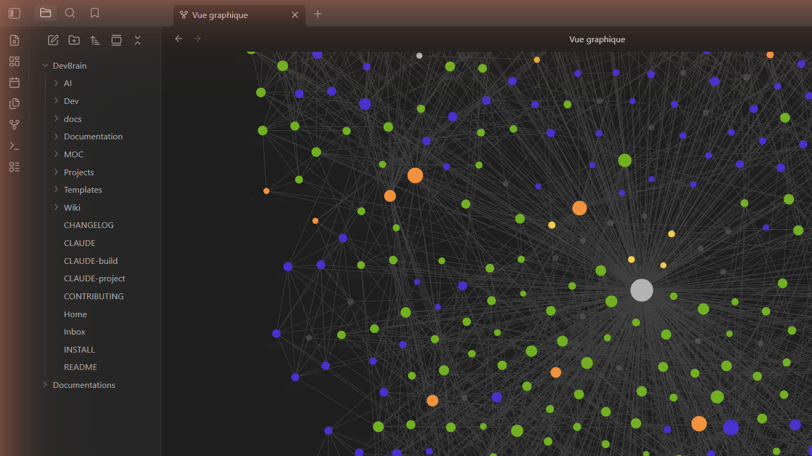

Le graphe affiche alors tes notes coloriées par niveau (domaines en or, hubs en orange, Dev en bleu, Wiki en vert) :

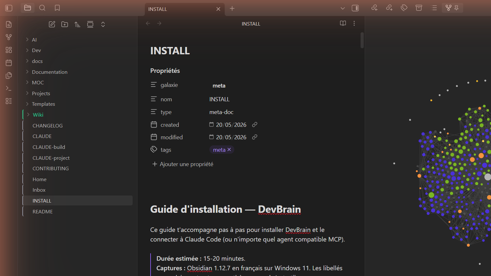

Si tu ne vois pas l'effet, refais "Reload app" (`Ctrl+R`).

> ℹ️ Le détail de ce code couleur (et la navigation en graphe local) vit dans `Documentation/perso/obsidian-graph.md`, la source de référence. Comme `.obsidian/graph.json` est gitignoré, **cette config est locale par machine** : à réappliquer sur chaque poste.

### C. Exclure les Roadmaps du graphe (optionnel)

`Wiki/Roadmaps/` est prévu pour des documents de référence à fort volume de wikilinks fantômes (héritage v1 : `Roadmap.md` ~1500 items, `Roadmap-AI.md`), pas encore remigrés en v2. Le jour où ils le seront, exclus-les du graphe pour éviter le nuage gris déconnecté :

1. Toujours dans les **Settings** du panneau graphe → onglet **Filtres** *(Filters)*
2. Dans le champ **Recherche** *(Search)*, coller :

   ```
   -path:Wiki/Roadmaps/
   ```

   Le `-` exclut.

> 💡 Cette exclusion est par-graphe (vue locale ou globale). Tu peux aussi simplement décocher **Existing files only** *(Fichiers existants uniquement)* dans Filters pour masquer tous les wikilinks vers des notes non-créées — utile en général au-delà du Roadmap.

---

## 12. Personnaliser les fichiers `CLAUDE.md`

Avant ta première vraie session, édite ces 3 fichiers pour remplacer les placeholders (`<ton_nom>`, `<tes_domaines>`, etc.) :

- `CLAUDE.md` — routeur (mode build vs projet)
- `CLAUDE-build.md` — contexte d'enrichissement du brain
- `CLAUDE-project.md` — **template** à copier dans tes futurs projets (pas à modifier en place)

Exemple minimal dans `CLAUDE.md` :

```markdown
## Identité utilisateur

Je suis floSa, dev full-stack. Domaines : Python (FastAPI, ML), TypeScript
(Next.js), DevOps (Docker, GitHub Actions). Je travaille seul ou en petite
équipe.
```

---

## 13. (Optionnel) Hook Stop pour la mémoire de session

**À quoi ça sert :** Claude Code peut exécuter un script à des moments précis (avant un tool call, après un edit, à la fin d'une session). Le hook **Stop** se déclenche quand tu fermes la conversation (Ctrl+D ou "fin de session"). Le script `AI/scripts/session_to_devbrain.py` lit la transcription de la session, en extrait un résumé structuré, et l'écrit dans `AI/sessions/YYYY-MM-DD-HHmm.md`.

Le but : la prochaine fois que tu ouvres Claude dans le vault, il lit automatiquement les 3 derniers résumés de session (instruction dans `CLAUDE.md`) et a le contexte de "où tu en étais". Tu évites de devoir re-briefer à chaque ouverture.

Sans ce hook, tu peux toujours obtenir le même résultat en disant **"fin de session"** explicitement à Claude — il écrira le résumé lui-même avant de te quitter. Le hook automatise juste le geste.

**Configuration** (à faire une seule fois, dans `~/.claude/settings.json` ou `.claude/settings.json` du vault) :

```json
{
  "hooks": {
    "Stop": [{
      "command": "python",
      "args": ["AI/scripts/session_to_devbrain.py"]
    }]
  }
}
```

Le script `session_to_devbrain.py` est déjà dans le repo. Adapte le chemin Python (`python3` sur Mac/Linux, chemin absolu si nécessaire).

---

## 14. Vérifier que tout marche

### a) Obsidian — Bases fonctionnent

Ouvre `Dev/Patterns/Comparatif - Frameworks LLM.base`. Tu dois voir un tableau des frameworks LLM (LangChain, LangGraph, LlamaIndex, DSPy, LiteLLM…) qui se remplit tout seul depuis le frontmatter :

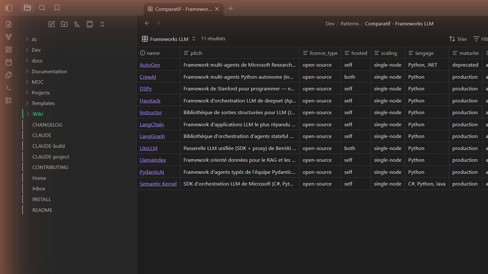

Si ça apparaît comme du texte brut au lieu d'un tableau, vérifie que ta version d'Obsidian est ≥ 1.10 (Bases est natif depuis cette version).

### b) Claude Code se connecte au vault

Dans un terminal, dans le dossier du vault :

```bash
cd ~/DevBrain
claude
```

Claude devrait :

1. Détecter le `CLAUDE.md` et te demander **"Mode build ou mode projet ?"**.
2. Pouvoir lister tes fiches Services. Teste :

```
> Liste-moi 5 fiches Services au hasard.
> Quelle est la note Postgres ? (devrait répondre "5")
```

Si tu obtiens des réponses cohérentes (pas une erreur MCP), tout est bon. 🎉

---

## 15. Dépannage

### `claude mcp list` n'affiche pas `devbrain` comme Connected

- Obsidian est-il lancé avec le vault DevBrain ouvert ? Le serveur Local REST API ne tourne **que pendant ce temps**.
- Le port 27124 est-il libre ? `netstat -an | findstr 27124` doit montrer `LISTENING` sur 127.0.0.1.
- La clé API est-elle correcte ? Re-copie depuis le panneau Local REST API (étape 7).
- Le plugin est-il bien **activé** (toggle violet) ? Settings → Modules complémentaires.

### Certificate error / SSL handshake failure

Local REST API utilise un certificat auto-signé. Le client `mcp-obsidian` est configuré pour l'accepter, mais si tu utilises un client custom :

- Soit télécharge le certificat depuis le lien *this certificate* du panneau d'options (capture en 7), et ajoute-le aux CA de confiance.
- Soit régénère-le : panneau Local REST API → **Re-generate certificates** (capture en 14). L'API key reste la même.
- En dernier recours, tu peux activer le HTTP non chiffré (même panneau, capture en 14) mais **uniquement sur ta machine locale** — jamais exposé sur le réseau.

### `npx skills add` échoue

Vérifie Node 18+ : `node --version`. Les anciennes versions de `npm` ne gèrent pas le CLI `skills`.

### Le `.base` apparaît comme du texte brut au lieu d'une table

Ta version d'Obsidian est trop ancienne. Bases est natif à partir d'Obsidian **1.10** (octobre 2025). Mets à jour Obsidian, ou utilise Dataview comme fallback (les comparatifs `.md` sont fournis aussi dans `Dev/Patterns/`).

### Templater n'insère pas les templates

Vérifie que **Template folder location** est bien réglé sur `Templates` (étape 8). Le champ est sensible à la casse.

### Le dossier `AI/` reste visible alors que j'ai cliqué Hide Folder

Vérifie que **Hidden File Visibility** est sur OFF dans les options File Hider. S'il est ON, le plugin sait que `AI/` doit être caché mais l'affiche quand même (mode "voir tout").

### Reset complet — je veux tout recommencer

- Désinstalle les 4 plugins (Settings → Modules complémentaires → corbeille).
- Réactive le mode restreint.
- Supprime `~/DevBrain/.obsidian/` (config du vault).
- Recommence depuis l'étape 4.

---

Tu es prêt. Pour la suite, consulte le [README](README.md) (concept, workflow, conventions) ou plonge directement dans `CLAUDE-build.md` si tu veux commencer à enrichir le brain.
