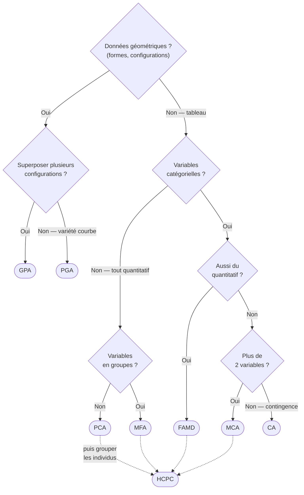

# Réduction de dimension

## Aperçu

- Famille de méthodes qui résument un tableau à beaucoup de variables par quelques axes synthétiques, en perdant le moins d'information possible.
- Objectifs : visualiser (2-3 axes), débruiter, décorréler, compresser, préparer un clustering ou un modèle.

## Concepts clés

### Deux grandes familles
- **Linéaire / factorielle** : axes = combinaisons linéaires des variables, espace euclidien. [[PCA]], [[CA]], [[MCA]], [[FAMD]], [[MFA]], [[GPA]]. Tradition « analyse de données » (Benzécri, Escofier, Pagès).
- **Non linéaire / manifold** : suppose que les données vivent sur une variété courbe de faible dimension. [[Manifold learning]] (Isomap, LLE, Kernel PCA), [[PGA]] (riemannien), [[t-SNE and UMAP]], autoencodeurs.

### Choisir selon le type de variables
- Quantitatives → [[PCA]].
- Une table de contingence (2 qualitatives) → [[CA]].
- Plusieurs qualitatives → [[MCA]].
- Mixte (continu + catégoriel) → [[FAMD]].
- Variables structurées en groupes → [[MFA]].
- Plusieurs configurations à superposer → [[GPA]].
- Données sur une variété (formes, tenseurs) → [[PGA]].

### Arbre de décision

PCA est ici le cas pivot (tout quantitatif, un seul bloc), au même niveau que FAMD et MFA — pas un fond de branche. GPA/PGA forment la branche géométrique ; HCPC prolonge les méthodes factorielles par un clustering.

### Après la projection
- Clustering sur les composantes → [[HCPC]] (CAH + k-means sur les axes).
- Le bruit se concentre dans les derniers axes ; n'en garder qu'une poignée débruite.

## Les maths, simplement

- But commun : trouver un sous-espace de dimension $k \ll p$ qui maximise l'inertie (variance) projetée, ou de façon équivalente minimise l'erreur de reconstruction.
- Cœur linéaire : décomposition en valeurs propres de la covariance / SVD du tableau prétraité. Chaque méthode factorielle = une SVD sur un tableau retravaillé (centrage, pondération, codage disjonctif…) propre au type de données.
- Inertie portée par l'axe $j$ : $\lambda_j / \sum_k \lambda_k$, avec $\lambda_j$ la $j$-ème valeur propre.

## En pratique

- Réfléchir au **type de variables** avant de choisir la méthode (erreur classique : PCA sur des codes catégoriels).
- Standardiser quand les unités diffèrent (sinon une variable à grande échelle domine).
- Choisir $k$ via le coude de l'éboulis (scree plot) ou un seuil d'inertie cumulée.
- Outils : `scikit-learn` (PCA), `prince` (Python : PCA, CA, MCA, FAMD, MFA, GPA), `FactoMineR` (R, la référence), `geomstats` (PGA), [[Dev/Services/umap-learn|umap-learn]] (UMAP, non linéaire).

## Approches voisines & alternatives

- [[Apprentissage non supervisé]] — le chapeau : réduire, regrouper, détecter l'anormal.
- [[PCA]] — le socle linéaire quantitatif dont tout le reste dérive.
- [[k-NN]] — le modèle que la réduction sauve : en grande dimension, les distances se concentrent et le voisinage perd son sens.
- [[CA]], [[MCA]], [[FAMD]], [[MFA]] — déclinaisons selon le type et la structure des variables.
- [[GPA]] — superposition de configurations multiples.
- [[PGA]] — l'extension non euclidienne (variétés riemanniennes).
- [[Manifold learning]] — la branche non linéaire générale (Isomap, LLE, Kernel PCA).
- [[t-SNE and UMAP]] — la branche non linéaire (manifold), pour visualiser plutôt que pour chiffrer.
- [[HCPC]] — le débouché naturel : classer sur les composantes.

## Pour aller plus loin

- Husson, Lê, Pagès — *Exploratory Multivariate Analysis by Example Using R* (FactoMineR).
- Sélection de variables (LASSO), feature hashing : alternatives non factorielles à la compression.
