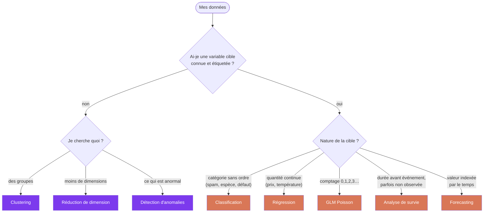
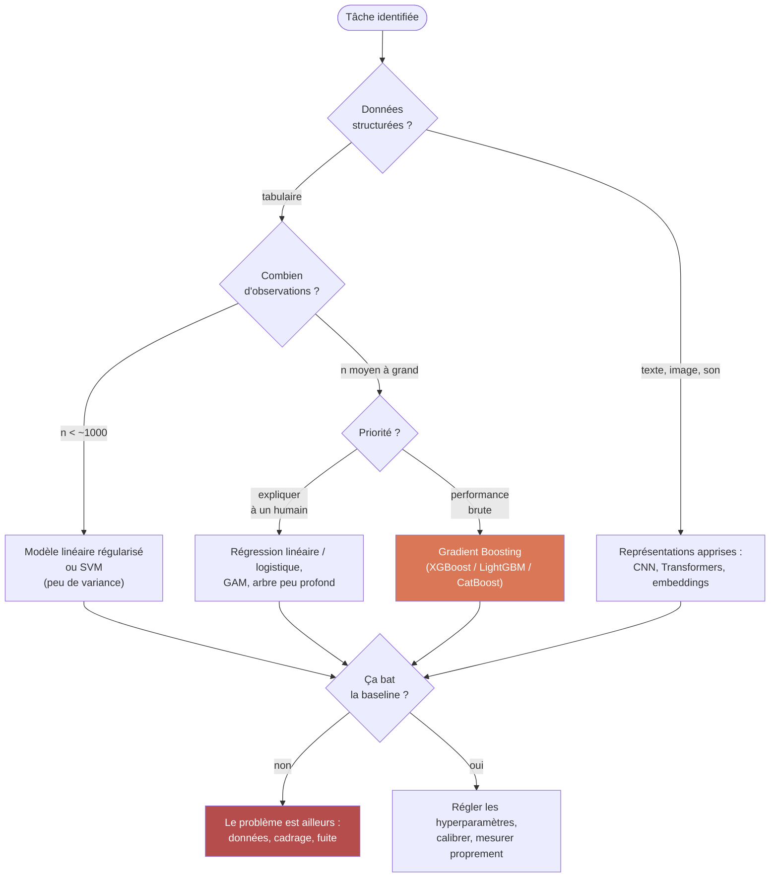

# Types de données et choix de modèle

## Aperçu

- Page d'**aiguillage** : quelle tâche et quel modèle selon la donnée disponible. Deux questions décident de presque tout — *ai-je une cible ?* et *de quelle nature est-elle ?*
- Le type des variables **explicatives** ne choisit pas le modèle, mais dicte le travail de préparation : standardiser, encoder, imputer. Un modèle mal nourri échoue quelle que soit sa puissance.

## Concepts clés

### 1. La cible décide de la tâche

C'est le premier embranchement, et le seul qui soit vraiment mécanique.

Les cas frontière, qui sont les seuls intéressants :

- **Cible ordinale** (« faible / moyen / fort ») — en [[Classification]] on perd l'ordre, en [[Régression]] on invente des distances entre modalités. Classer reste le défaut ; passer en régression si les modalités sont nombreuses et régulièrement espacées.
- **Cible continue qu'on veut binariser** (« prix > 100k ? ») — ne le faire que si la **décision métier** est réellement binaire. Sinon on jette de l'information gratuitement.
- **Comptage** — ni vraiment continu, ni catégoriel : positif, discret, souvent asymétrique. Une [[Régression linéaire|régression linéaire]] y prédit des valeurs négatives. Utiliser un [[GLM]] (Poisson, binomiale négative).
- **Durée avec censure** (clients encore actifs, pièces non encore tombées en panne) — une régression classique biaise le résultat en traitant « pas encore arrivé » comme « n'arrivera pas ». Voir [[Analyse de survie]].
- **Données indexées par le temps** — l'hypothèse i.i.d. tombe, l'ordre porte l'information, la validation change ([[Forecasting framing]], [[Walk-forward CV]]).

### 2. Le type des variables décide de la préparation

| Type de variable | Exemple | Ce qu'il faut en faire |
|---|---|---|
| **Quantitative continue** | prix, température | Standardiser pour les modèles à distance / linéaires ([[Mise à l'échelle]]) ; rien pour les arbres |
| **Quantitative discrète** | nombre d'enfants | Comme continue ; attention si en réalité c'est une catégorie codée en chiffres |
| **Catégorielle nominale** | ville, marque | Encoder ([[Encodage des variables catégorielles]]) : one-hot si peu de modalités, target/ordinal si beaucoup |
| **Catégorielle ordinale** | S / M / L | Encoder en respectant l'ordre (ordinal), pas en one-hot |
| **Binaire** | oui / non | 0-1, aucun traitement |
| **Date / temps** | timestamp | Ne jamais donner brut : extraire mois, jour, saisonnalité ([[Time series feature engineering]]) |
| **Texte** | avis client | Vectoriser : [[TF-IDF]] (baseline) ou [[embeddings]] |
| **Image / son** | photo, spectrogramme | Représentations apprises : [[CNN]], [[STFT et spectrogramme]] |

### 3. Ce que chaque modèle exige de la donnée

C'est le tableau à consulter quand la donnée est difficile plutôt que la tâche.

| Modèle | Standardisation | Catégoriel brut | NaN gérés | Extrapole | À l'aise si $d \gg n$ | Lisible |
|---|---|---|---|---|---|---|
| [[Régression linéaire]] / [[Régression logistique]] | **oui** | non → encoder | non | oui | avec [[Régularisation]] | ★★★ |
| [[Régularisation]] (Ridge/Lasso) | **oui** | non → encoder | non | oui | **oui** | ★★★ |
| [[Arbres de décision]] | non | non (sklearn) | non | **non** | moyen | ★★★ |
| [[Random Forest]] | non | non (sklearn) | non | **non** | moyen | ★ |
| [[Gradient Boosting (GBDT)]] | non | **oui** (LightGBM/CatBoost) | **oui** | **non** | moyen | ★ |
| [[SVM]] | **oui, critique** | non → encoder | non | oui | **oui** | ★ |
| [[k-NN]] | **oui, critique** | non → encoder | non | non | **non** | ★★ |
| [[Naive Bayes]] | non | oui (variante multinomiale) | non | oui | **oui** | ★★ |
| [[Analyse discriminante]] | conseillée | non → encoder | non | oui | avec `shrinkage` | ★★ |
| [[Gaussian Process]] | **oui** | non → encoder | non | oui | non | ★ |
| [[Régression quantile]] | **oui** | non → encoder | non | oui | avec L1 | ★★★ |
| [[Perceptron et MLP]] | **oui** | non → encoder | non | limité | non | ☆ |

Lecture : « Extrapole » = sait prédire hors de la plage de valeurs vue à l'entraînement. Les arbres, non — ils prédisent une constante par morceaux, donc plafonnent au dernier seuil appris. C'est la raison la plus fréquente d'un [[Gradient Boosting (GBDT)|GBDT]] qui échoue sur une tendance croissante.

### 4. Choisir dans une tâche donnée

## Les maths, simplement

- **Pourquoi standardiser pour [[k-NN]] et [[SVM]] et pas pour les arbres.** Ces deux-là ne voient que des distances : $d(x, x') = \sqrt{\sum_j (x_j - x'_j)^2}$. Une variable en euros (écart ~10 000) écrase une variable en années (écart ~10) — la somme est dominée par un seul terme. Un [[Arbres de décision|arbre]] ne compare jamais deux variables entre elles : il teste `x_j < seuil`, variable par variable. Toute transformation **monotone** laisse ses découpages inchangés.
- **Pourquoi $d \gg n$ casse [[k-NN]] et pas [[Régularisation|Ridge]].** En grande dimension, le rapport entre distance la plus proche et la plus lointaine tend vers 1 : plus personne n'est « voisin » de personne, la notion de proximité perd son sens. Une pénalité $\lambda \lVert \beta \rVert^2$, elle, contraint simplement les coefficients et reste bien posée même quand $X^\top X$ n'est pas inversible.
- **Le théorème qui interdit de tricher** : aucun modèle n'est meilleur que les autres en moyenne sur *tous* les problèmes possibles ([[No Free Lunch theorem]]). Tout gain vient d'un **biais inductif** adapté à la structure réelle des données — d'où l'utilité de ce tableau plutôt que d'un classement absolu.

## En pratique

- **Commencer par la baseline, toujours.** Classe majoritaire ou moyenne de la cible, puis un modèle linéaire. Ce n'est pas une formalité : c'est la seule référence qui dise si le problème est apprenable.
- **Sur tabulaire, le boosting d'arbres est le défaut raisonnable** ([[Gradient Boosting (GBDT)]]). Il gagne presque toujours, encaisse les échelles hétérogènes, les NaN et les interactions sans préparation. Les réseaux de neurones n'y gagnent que rarement.
- **Le type de données élimine plus d'options que la performance n'en départage.** Beaucoup de NaN et du catégoriel à forte cardinalité → CatBoost/LightGBM. $d \gg n$ (génomique, spectres) → linéaire pénalisé ou [[SVM]]. Besoin d'expliquer chaque décision → [[GAM]] ou arbre court, quel qu'en soit le coût en performance.
- **Toute préparation apprise s'apprend sur le train seul.** Moyenne de standardisation, catégories d'encodage, valeurs d'imputation : les calculer sur l'ensemble des données est une fuite silencieuse qui gonfle le score et s'effondre en production ([[Data leakage]]). Utiliser un `Pipeline`.
- **Ne pas choisir un modèle sur un seul découpage.** L'écart entre deux modèles est souvent inférieur à la variance entre folds ([[Validation croisée]]).
- Outils : [[Dev/Services/Scikit-Learn|sklearn]] (`Pipeline`, `ColumnTransformer` — le bon réflexe pour appliquer un traitement par type de colonne), [[Dev/Services/category_encoders|category_encoders]], [[Dev/Services/ydata-profiling|ydata-profiling]] pour typer les variables avant de décider ([[EDA automatisée & profiling]]).

## Approches voisines & alternatives

- [[Apprentissage supervisé]] — le cadre quand une cible existe.
- [[Apprentissage non supervisé]] — le cadre quand il n'y en a pas.
- [[Classification]] / [[Régression]] — les deux branches supervisées, une fois la cible qualifiée.
- [[Ingénierie des caractéristiques]] — le travail sur les variables une fois les types identifiés.
- [[Mise à l'échelle]] / [[Encodage des variables catégorielles]] / [[Imputation des valeurs manquantes]] — les trois préparations que ce tableau appelle.
- [[Compromis biais-variance]] — pourquoi le meilleur modèle dépend de $n$.
- [[No Free Lunch theorem]] — pourquoi aucun modèle ne gagne partout.
- [[Optimisation d'hyperparamètres]] — l'étape d'après, une fois la famille choisie.

## Pour aller plus loin

- Documentation scikit-learn — *Choosing the right estimator* : le cheat-sheet historique, dont le premier embranchement (ai-je une cible ?) structure cette page.
- Hastie, Tibshirani, Friedman — *The Elements of Statistical Learning*, ch. 2 et 7.
- Grinsztajn, Oyallon, Varoquaux (2022) — *Why do tree-based models still outperform deep learning on tabular data?*
